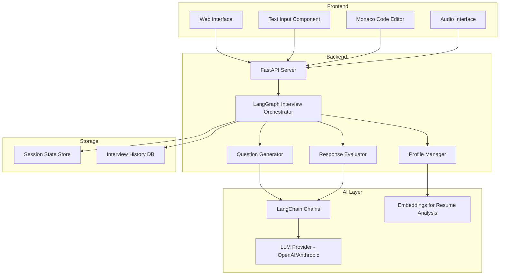
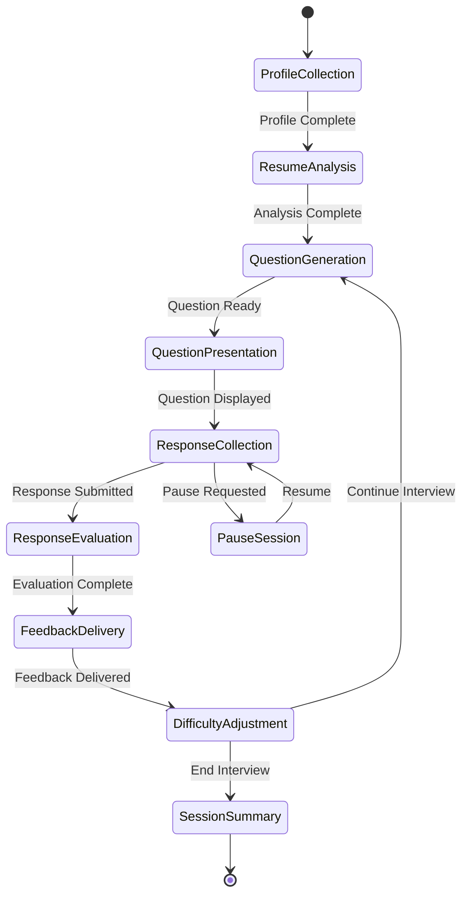

# Design Document: AI Interviewer

## Overview

The AI Interviewer is a technical interview practice platform built using Python, LangChain, and LangGraph. The system orchestrates multi-modal interview sessions that adapt to candidate profiles and provide realistic practice experiences.

The architecture follows a modular design with clear separation between:
- **Backend AI orchestration** (LangGraph state machines, LangChain chains)
- **Question generation and evaluation** (LLM-powered with structured outputs)
- **Frontend interfaces** (text input, Monaco code editor, audio interface)
- **Session management** (state persistence and resume capability)

The system uses LangGraph to model the interview as a stateful workflow, where each node represents a stage (profile collection, question generation, response evaluation, feedback delivery) and edges represent transitions based on candidate actions and performance.

## Architecture

### High-Level Architecture



### LangGraph State Machine

The interview workflow is modeled as a LangGraph state machine:



## Components and Interfaces

### 1. Profile Manager

**Responsibility:** Collect, validate, and analyze candidate profile information.

**Interface:**
```python
class ProfileManager:
    def collect_profile(self, job_role: str, years_exp: int, 
                       target_company: str, resume: File) -> Profile:
        """Collect and validate candidate profile."""
        pass
    
    def parse_resume(self, resume: File) -> ResumeData:
        """Extract skills, technologies, and experience from resume."""
        pass
    
    def validate_profile(self, profile: Profile) -> ValidationResult:
        """Ensure all required fields are present and valid."""
        pass
```

**Implementation Details:**
- Uses LangChain document loaders for resume parsing (PDF, DOCX)
- Employs LLM with structured output to extract skills and experience
- Validates required fields before allowing interview to proceed
- Stores profile in LangGraph state for access throughout session

### 2. Question Generator

**Responsibility:** Generate personalized interview questions based on candidate profile.

**Interface:**
```python
class QuestionGenerator:
    def generate_question(self, profile: Profile, 
                         difficulty: int,
                         question_type: QuestionType) -> Question:
        """Generate a single interview question."""
        pass
    
    def select_question_type(self, state: InterviewState) -> QuestionType:
        """Determine next question type (theory, coding, behavioral)."""
        pass
    
    def adjust_difficulty(self, performance_history: List[Response]) -> int:
        """Calculate appropriate difficulty level."""
        pass
```

**Implementation Details:**
- Uses LangChain chains with few-shot prompting for question generation
- Incorporates company-specific patterns from knowledge base
- Maintains question history to avoid repetition
- Difficulty scale: 1-10 (mapped from experience level and performance)
- Question types: THEORY, CODING, BEHAVIORAL

**LangChain Chain Structure:**
```python
question_chain = (
    profile_prompt 
    | llm 
    | StructuredOutputParser(Question)
)
```

### 3. Response Evaluator

**Responsibility:** Assess candidate responses and provide constructive feedback.

**Interface:**
```python
class ResponseEvaluator:
    def evaluate_theory(self, question: Question, 
                       response: str) -> Evaluation:
        """Evaluate text-based theory response."""
        pass
    
    def evaluate_code(self, question: CodingQuestion, 
                     code: str, 
                     language: str) -> CodeEvaluation:
        """Execute and evaluate code submission."""
        pass
    
    def generate_feedback(self, evaluation: Evaluation) -> Feedback:
        """Create constructive feedback from evaluation."""
        pass
```

**Implementation Details:**
- Theory evaluation uses LLM with rubric-based prompting
- Code evaluation combines test execution + LLM code review
- Feedback includes: correctness score, strengths, improvements, suggestions
- Uses LangChain structured output for consistent evaluation format

**Code Execution:**
- Sandboxed execution environment (Docker containers or cloud functions)
- Timeout limits (5 seconds for most problems)
- Memory limits to prevent resource exhaustion
- Test cases generated or predefined based on problem

### 4. Audio Interface

**Responsibility:** Handle voice-based interview interactions.

**Interface:**
```python
class AudioInterface:
    def text_to_speech(self, text: str) -> AudioStream:
        """Convert question text to speech."""
        pass
    
    def speech_to_text(self, audio: AudioStream) -> Transcription:
        """Transcribe candidate spoken response."""
        pass
    
    def validate_transcription(self, transcription: Transcription) -> bool:
        """Check if transcription confidence is acceptable."""
        pass
```

**Implementation Details:**
- Text-to-speech: OpenAI TTS or ElevenLabs API
- Speech-to-text: OpenAI Whisper or AssemblyAI
- Confidence threshold: 0.85 for automatic acceptance
- Fallback to text input if confidence is low
- Real-time transcription display for candidate verification

### 5. Code Editor Integration

**Responsibility:** Provide Monaco editor interface for coding questions.

**Interface:**
```python
class CodeEditorInterface:
    def configure_editor(self, language: str) -> EditorConfig:
        """Set up editor for specific programming language."""
        pass
    
    def execute_code(self, code: str, language: str, 
                    test_cases: List[TestCase]) -> ExecutionResult:
        """Run code against test cases."""
        pass
    
    def format_code(self, code: str, language: str) -> str:
        """Auto-format code using language-specific formatter."""
        pass
```

**Implementation Details:**
- Frontend: Monaco Editor (VS Code's editor)
- Supported languages: Python, JavaScript, Java, C++, Go
- Language-specific features: syntax highlighting, autocomplete, linting
- Backend code execution via secure sandbox
- Test results displayed inline with pass/fail indicators

### 6. Interview Orchestrator (LangGraph)

**Responsibility:** Manage interview workflow and state transitions.

**Interface:**
```python
class InterviewOrchestrator:
    def create_session(self, profile: Profile) -> InterviewSession:
        """Initialize new interview session."""
        pass
    
    def process_event(self, session_id: str, 
                     event: Event) -> StateUpdate:
        """Handle events and transition state."""
        pass
    
    def pause_session(self, session_id: str) -> None:
        """Pause interview and save state."""
        pass
    
    def resume_session(self, session_id: str) -> InterviewState:
        """Restore paused interview session."""
        pass
```

**Implementation Details:**
- Built using LangGraph's StateGraph
- State includes: profile, current_question, response_history, difficulty, question_count
- Nodes: profile_collection, question_generation, response_evaluation, feedback_delivery, summary_generation
- Edges: conditional routing based on user actions and performance
- Checkpointing for pause/resume functionality
- State persisted to database (PostgreSQL or MongoDB)

**LangGraph State Definition:**
```python
class InterviewState(TypedDict):
    profile: Profile
    current_question: Optional[Question]
    response_history: List[Response]
    difficulty_level: int
    question_count: int
    session_status: str  # active, paused, completed
    performance_metrics: PerformanceMetrics
```

### 7. Session Manager

**Responsibility:** Persist and retrieve interview sessions.

**Interface:**
```python
class SessionManager:
    def save_session(self, session: InterviewSession) -> str:
        """Persist session state and return session ID."""
        pass
    
    def load_session(self, session_id: str) -> InterviewSession:
        """Retrieve session by ID."""
        pass
    
    def save_history(self, session_id: str, 
                    summary: SessionSummary) -> None:
        """Store completed interview in history."""
        pass
    
    def get_history(self, candidate_id: str) -> List[SessionSummary]:
        """Retrieve past interview sessions."""
        pass
```

**Implementation Details:**
- Session state stored in database with JSON serialization
- History includes: timestamp, questions asked, performance metrics, feedback
- Candidate identification via email or unique ID
- Session expiry: 7 days for paused sessions

## Data Models

### Profile
```python
@dataclass
class Profile:
    job_role: str
    years_experience: int
    target_company: str
    resume_data: ResumeData
    skills: List[str]
    technologies: List[str]
```

### ResumeData
```python
@dataclass
class ResumeData:
    raw_text: str
    extracted_skills: List[str]
    work_experience: List[WorkExperience]
    education: List[Education]
    projects: List[Project]
```

### Question
```python
@dataclass
class Question:
    id: str
    type: QuestionType  # THEORY, CODING, BEHAVIORAL
    difficulty: int  # 1-10
    text: str
    context: Optional[str]
    test_cases: Optional[List[TestCase]]  # For coding questions
    expected_topics: List[str]  # For evaluation
```

### Response
```python
@dataclass
class Response:
    question_id: str
    response_text: str
    code: Optional[str]
    language: Optional[str]
    time_taken: int  # seconds
    timestamp: datetime
```

### Evaluation
```python
@dataclass
class Evaluation:
    correctness_score: float  # 0.0 - 1.0
    completeness_score: float
    clarity_score: float
    technical_depth_score: float
    overall_score: float
    strengths: List[str]
    improvements: List[str]
    suggestions: List[str]
```

### CodeEvaluation
```python
@dataclass
class CodeEvaluation(Evaluation):
    test_results: List[TestResult]
    time_complexity: str
    space_complexity: str
    code_quality_score: float
    execution_time: float
```

### SessionSummary
```python
@dataclass
class SessionSummary:
    session_id: str
    profile: Profile
    questions_answered: int
    average_score: float
    correctness_rate: float
    average_response_time: float
    strengths: List[str]
    knowledge_gaps: List[str]
    recommended_topics: List[str]
    timestamp: datetime
```


## Correctness Properties

A property is a characteristic or behavior that should hold true across all valid executions of a system—essentially, a formal statement about what the system should do. Properties serve as the bridge between human-readable specifications and machine-verifiable correctness guarantees.

### Property 1: Profile Validation Completeness

*For any* profile submission, if any required field (job_role, years_experience, target_company, resume) is missing or invalid, the validation SHALL reject the profile and provide an error message identifying the missing or invalid field.

**Validates: Requirements 1.2, 1.5**

### Property 2: Resume Parsing Produces Structured Data

*For any* valid resume file (PDF or DOCX), parsing SHALL extract structured data including at least one of: skills, work experience, education, or projects.

**Validates: Requirements 1.3**

### Property 3: Session State Persistence

*For any* interview session, retrieving the session by its ID SHALL return the same profile, current question, response history, difficulty level, and question count that were stored.

**Validates: Requirements 1.4, 6.4, 10.3**

### Property 4: Question Generation Reflects Profile

*For any* profile with specified job role and experience level, generated questions SHALL have difficulty levels within the range appropriate for that experience level (e.g., 1-4 for junior, 4-7 for mid-level, 7-10 for senior).

**Validates: Requirements 2.1, 2.5**

### Property 5: Question Type Diversity

*For any* interview session with at least 6 questions, the questions SHALL include at least two different question types (theory, coding, or behavioral).

**Validates: Requirements 2.3**

### Property 6: Theory Evaluation Produces Structured Feedback

*For any* theory question response, evaluation SHALL produce feedback containing correctness score, completeness score, clarity score, technical depth score, strengths list, improvements list, and suggestions list.

**Validates: Requirements 3.3, 3.4, 7.2**

### Property 7: Code Execution Returns Results

*For any* code submission in a supported language (Python, JavaScript, Java, C++, Go), execution SHALL return test results indicating pass/fail status for each test case.

**Validates: Requirements 4.4**

### Property 8: Code Evaluation Includes Complexity Analysis

*For any* code submission, evaluation SHALL include correctness score, time complexity assessment, space complexity assessment, code quality score, and test results.

**Validates: Requirements 4.5, 7.3**

### Property 9: Code Execution Errors Are Reported

*For any* code submission that fails to execute or fails test cases, the evaluation SHALL include error messages or failed test case details.

**Validates: Requirements 4.6**

### Property 10: Text-to-Speech Conversion

*For any* question text when audio mode is enabled, the Audio_Interface SHALL generate an audio stream representation of that text.

**Validates: Requirements 5.1**

### Property 11: Speech-to-Text Transcription

*For any* audio input when audio mode is enabled, the Audio_Interface SHALL produce a transcription with a confidence score.

**Validates: Requirements 5.2**

### Property 12: Low Confidence Transcription Handling

*For any* transcription with confidence below 0.85, the system SHALL prompt the candidate for clarification or text input.

**Validates: Requirements 5.5**

### Property 13: Session ID Uniqueness

*For any* two interview sessions created at different times, their session IDs SHALL be different.

**Validates: Requirements 6.1**

### Property 14: Pause-Resume State Preservation (Round Trip)

*For any* interview session, pausing the session and then resuming it SHALL restore the exact state including profile, current question, response history, difficulty level, and question count.

**Validates: Requirements 6.2, 6.5**

### Property 15: Session Termination Produces Summary

*For any* interview session that is ended, the system SHALL generate a session summary containing session ID, profile, questions answered count, average score, and timestamp.

**Validates: Requirements 6.3, 8.1**

### Property 16: Summary Contains Required Metrics

*For any* completed interview session, the generated summary SHALL include questions answered, correctness rate, average response time, areas of strength, knowledge gaps, recommended topics, and performance comparison data.

**Validates: Requirements 8.2, 8.3, 8.4**

### Property 17: Session History Persistence

*For any* completed interview session, storing it in history and then retrieving history for that candidate SHALL include that session's summary.

**Validates: Requirements 8.5**

### Property 18: Multi-Language Code Execution

*For any* supported programming language (Python, JavaScript, Java, C++, Go), the system SHALL successfully execute syntactically valid code and return execution results.

**Validates: Requirements 9.2, 9.3**

### Property 19: Difficulty Adaptation to Performance

*For any* interview session, if a candidate answers N consecutive questions correctly (N ≥ 3), the difficulty level of subsequent questions SHALL be higher than the initial difficulty, and if a candidate answers N consecutive questions incorrectly (N ≥ 3), the difficulty level SHALL be lower than the initial difficulty.

**Validates: Requirements 10.1, 10.2**

### Property 20: Difficulty Bounds Enforcement

*For any* interview session with specified experience level, the difficulty of all generated questions SHALL remain within the valid range for that experience level (junior: 1-5, mid: 3-8, senior: 6-10).

**Validates: Requirements 10.4**

### Property 21: Difficulty Adjustment Explanation

*For any* difficulty level change during an interview session, the system SHALL provide an explanation message to the candidate.

**Validates: Requirements 10.5**

## Error Handling

### Input Validation Errors

**Profile Validation:**
- Missing required fields → Return ValidationError with field names
- Invalid years of experience (negative or > 50) → Return ValidationError
- Unsupported resume format → Return FileFormatError
- Resume parsing failure → Return ParsingError with fallback to manual entry

**Code Submission Errors:**
- Unsupported language → Return LanguageNotSupportedError
- Code execution timeout (> 5 seconds) → Return TimeoutError
- Code execution memory limit exceeded → Return MemoryError
- Syntax errors → Return SyntaxError with line number and description

### LLM and API Errors

**LLM Failures:**
- LLM API timeout → Retry up to 3 times with exponential backoff
- LLM rate limit → Queue request and retry after delay
- LLM returns invalid structured output → Log error and request regeneration
- LLM unavailable → Return graceful error message to user

**Audio API Failures:**
- TTS API failure → Fall back to text-only mode
- STT API failure → Prompt user to type response
- Low transcription confidence → Display transcription and ask for confirmation

### Session Management Errors

**State Persistence:**
- Database connection failure → Retry with exponential backoff, cache state in memory
- Session not found → Return SessionNotFoundError
- Session expired (> 7 days paused) → Return SessionExpiredError

**Concurrency:**
- Multiple simultaneous requests for same session → Use optimistic locking
- State update conflicts → Last write wins with conflict logging

### Recovery Strategies

1. **Graceful Degradation:** If audio fails, fall back to text mode
2. **Retry Logic:** Transient failures retry with exponential backoff (max 3 attempts)
3. **User Notification:** All errors provide clear, actionable messages
4. **State Preservation:** Errors during question generation don't lose response history
5. **Logging:** All errors logged with context for debugging

## Testing Strategy

### Dual Testing Approach

The AI Interviewer will employ both unit testing and property-based testing to ensure comprehensive coverage:

- **Unit tests** verify specific examples, edge cases, and error conditions
- **Property tests** verify universal properties across all inputs
- Both approaches are complementary and necessary for robust validation

### Unit Testing

Unit tests focus on:
- **Specific examples:** Valid profile submission, successful code execution, typical interview flow
- **Edge cases:** Empty resume, maximum difficulty level, session timeout
- **Error conditions:** Invalid file formats, code execution failures, API timeouts
- **Integration points:** LangChain chain execution, LangGraph state transitions, database operations

**Testing Framework:** pytest for Python backend

**Key Unit Test Areas:**
1. Profile validation with various invalid inputs
2. Resume parsing with different file formats
3. Question generation with edge case profiles
4. Code execution sandbox with malicious code attempts
5. Audio interface with poor quality audio samples
6. Session pause/resume with various states
7. Error handling for all identified error conditions

### Property-Based Testing

Property tests verify universal correctness properties across randomized inputs.

**Testing Framework:** Hypothesis (Python property-based testing library)

**Configuration:**
- Minimum 100 iterations per property test
- Each test tagged with format: **Feature: ai-interviewer, Property {number}: {property_text}**
- Randomized input generation for profiles, questions, responses, and sessions

**Property Test Implementation:**

Each correctness property listed above will be implemented as a single property-based test. Examples:

```python
# Feature: ai-interviewer, Property 1: Profile Validation Completeness
@given(profiles_with_missing_fields())
@settings(max_examples=100)
def test_profile_validation_rejects_incomplete(profile):
    result = profile_manager.validate_profile(profile)
    assert not result.is_valid
    assert len(result.errors) > 0
    assert any(field in error for field in profile.missing_fields() for error in result.errors)

# Feature: ai-interviewer, Property 14: Pause-Resume State Preservation
@given(interview_sessions())
@settings(max_examples=100)
def test_pause_resume_preserves_state(session):
    original_state = session.get_state()
    session_id = orchestrator.pause_session(session.id)
    restored_session = orchestrator.resume_session(session_id)
    restored_state = restored_session.get_state()
    assert original_state == restored_state
```

**Input Generators:**
- Profile generator: random job roles, experience levels (0-30 years), companies, resume content
- Question generator: random question types, difficulties, content
- Response generator: random text responses, code in various languages
- Session generator: random session states with varying history lengths

### Integration Testing

**End-to-End Flows:**
1. Complete interview flow: profile → questions → responses → summary
2. Pause and resume mid-interview
3. Multi-modal interaction: text → audio → code
4. Difficulty adaptation across multiple questions

**External Dependencies:**
- Mock LLM responses for deterministic testing
- Mock audio APIs for consistent transcription testing
- Test database for session persistence
- Sandboxed code execution environment

### Performance Testing

While not part of correctness properties, performance tests ensure:
- Response evaluation completes within 5 seconds (Requirement 7.1)
- Code execution respects timeout limits
- Session state retrieval is fast (< 100ms)
- LLM API calls have appropriate timeouts

### Test Coverage Goals

- Unit test coverage: > 80% of code
- Property test coverage: 100% of correctness properties
- Integration test coverage: All major user flows
- Error handling coverage: All identified error conditions
